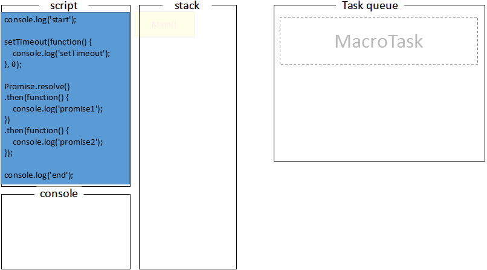

# 事件循环机制（Event Loop）

2018 年 03 月 20 日

## 一、为什么会有这个机制

> 单线程进行同步操作易阻塞的问题，提出异步操作，需要使用事件循环和消息队列机制来协调。

## 二、为什么同步会存在阻塞的情况

### 1、JS 是单线程的，即只有一个主线程

> JS 引擎中负责解释和执行代码的线程只有一个，即一个主线程。

## 三、异步操作中，主线程和工作线程如何协调

> 主线程发起异步请求，工作线程接收请求并告知主线程已经收到，表现形式是返回回调函数，工作线程完成工作后，利用消息队列和事件循环机制，通知主线程，主线程收到通知后，执行其回调函数。

## 四、工作线程怎样通知主线程？

### 1、工作线程将消息放到消息队列，主线程通过事件循环机制去取消息。

**消息：注册异步任务时添加的回调函数。**

## 五、涉及知识点

### 1、宏任务、微任务、调用栈

- **`宏任务（Macrotask）`**：**整体 JavaScript 代码（script 标签内）、全局代码，事件回调（鼠标、键盘、网络事件），XHR 回调，定时器（setTimeout / setInterval / setImmediate）的回调，IO 操作，requestAnimationFrame**
- **`微任务（Microtask）`**：**更新应用程序状态的任务，包括 Promise 回调，MutationObserver，process.nextTick，Object.observe，async function（异步函数）**
- **`调用栈（call stack）`**：主线程在调用栈中执行任务。

### 2、详细过程

1. **script 标签内代码全部压入调用栈**，依次执行，有返回值时，会从调用栈中弹出。返回值是属于宏任务则被压入宏任务队列，属于微任务则被压入微任务队列。

2. 当调用栈是空的时，所有排队的**微任务会一个接一个**从微任务任务队列中弹出进入调用栈中，然后在调用栈中被执行然后弹出。

3. 如果调用栈和微任务队列都是空的，事件循环会检查宏任务队列里是否还有任务。如果宏任务中还有任务，会从**宏任务队列中弹出一个**进入调用栈，被执行后会从调用栈中弹出，再重复第二步的操作。

### 3、循环过程

1. **script 里的代码依次被压入调用栈执行然后弹出。根据返回值的类型放入对应的任务队列中。**

2. **调用栈为空时，检查微任务队列是否为空，非空则到 3，为空则到 4**

3. **依次执行微任务中的所有任务，执行完成返回到步骤 2**

4. **先进行一轮视图更新操作（不一定非要更新），检查宏任务队列是否为空，非空则取出一个任务执行。**

```javascript
console.log('start');

setTimeout(function() {
  console.log('setTimeout');
}, 0);

Promise.resolve().then(function() {
  console.log('promise1');
}).then(function() {
  console.log('promise2');
})

console.log('end');

// start => end => promise1 => promise2 => setTimeout
```



首先，全局代码压入调用栈执行，打印 `start`；

接下来 setTimeout 的回调压入 macrotask 队列，promise.then 回调放入 microtask 队列，最后执行 console.log(end)，打印出 `end`；

至此，调用栈中的代码被执行完成，检查微任务队列，微任务队列不为空，依次执行 microtask 队列的任务了，执行 promise 回调打印 `promise1`；

promise 状态变为 fullfilled 又触发一个 then 回调，继续压入 microtask 队列，event loop 会把当前的 microtask 队列一直执行完，此时执行第二个 promise.then 回调打印出 `promise2`；

这时 microtask 队列已经为空，从上面的流程图可以知道，接下来主线程会去做一些 UI 渲染工作（不一定会做），然后开始下一轮 event loop，执行 setTimeout 的回调，打印出 `setTimeout`；

这个过程会不断重复，也就是所谓的事件循环。

### 4、视图更新

上面事件循环过程有提到，当执行完一次 **microtask** 队列任务时，将进行视图渲染。

## 五、练习题

```javascript
async function async1() {
    console.log("async1 begin");
    await async2();
    console.log("async end");
}
async function async2(){
    console.log("async2");
}
console.log("script start");
setTimeout(function(){
    console.log("setTimeout");
}, 0);
async1();
new Promise(function(resolve){
    console.log("promise1");
    resolve();
}).then(function(){
    console.log("promise2");
});
console.log("script end");

// script start => async1 begin => async2 => promise1
//  => script end  => async end => promise2 => setTimeout

// 1. 调用栈为空，Microtask 队列为空，Macrotask 队列里有 script 全局代码。
// 2. 调用栈读取 Macrotask 队列，开始执行任务。
// -  2.1 前面 8 行是定义异步函数，跳过，遇到 console.log 属于同步任务，直接打印 **script start**
// -  2.2 setTimeout 为宏任务，压进宏任务队列。
// -  2.3 调用异步函数 async1，遇到 console.log 属于同步任务，直接打印 **async1 begin**
// -  2.4 调用异步函数 async2，遇到 console.log 属于同步任务，直接打印 **async2**
// -  2.5 await 为微任务，压进微任务队列。
// -  2.6 遇到 new Promise，其参数是一个函数，里面的 console 代码属于同步任务，直接打印 **promise1**
// -  2.7 promise.then 属于微任务，压进微任务队列。
// -  2.8 遇到 console.log 属于同步任务，直接打印 **script end**
// 3. 当前 Macrotask 队列执行完毕，推出调用栈。调用栈读取 Microtask 队列，开始执行任务。
// -  3.1 await 为微任务，执行该修饰符后面的代码，打印 **async end**
// -  3.2 promise.then 属于微任务，执行其状态为 fullfilled 的回调，直接打印 **promise2**
// 4. 当前 Microtask 队列执行完毕，推出调用栈。结束一轮事件循环。调用栈读取 Macrotask 队列，开始执行任务。
// -  4.1 直接打印 **setTimeout**
```

```javascript
setTimeout(() => { console.log('a'); }, 0);
Promise.resolve().then(() => {
	console.log('b');
}).then(() => {
	console.log('c');
});

// b => c => a

// 1. 调用栈为空，Microtask 队列为空，Macrotask 队列里有 script 全局代码。
// 2. 调用栈读取 Macrotask 队列，开始执行任务。
// -  2.1 遇到 setTimeout，将其压入宏任务队列。
// -  2.2 遇到 Promise.resolve()，代表该 promise 已是 resolved 状态，将 then 压入微任务队列。
// 3. 当前 Macrotask 队列执行完毕，推出调用栈。调用栈读取 Microtask 队列，开始执行任务。
// -  3.1 打印 **b**，又遇到then，将其压入微任务队列。
// -  3.2 检查微任务队列不为空，打印 **c**
// 4. 当前 Microtask 队列执行完毕，推出调用栈。结束一轮事件循环。调用栈读取 Macrotask 队列，开始执行任务
// -  4.1 打印 **a**
```

```javascript
console.log('script start');
setTimeout(function () {
		console.log('timeout 1')
}, 1000);
setTimeout(function () {
		console.log('timeout 2')
}, 0);
console.log('b');
new Promise((resolve, reject) => {
		console.log('promise1');
		resolve();
		console.log('promise2');
}).then(() => {
		console.log('promise3');
	}, () => {
		console.log('promise4');
	}).then((x) => {
		console.log('promise5');
});
setTimeout(function () {
		console.log('timeout 3')
}, 0);
console.log('script end');

// script start => b => promise1 => promise2 => script end => promise3 => promise5
// => timeout 2 => timeout 3 => timeout 1

// 1. 调用栈为空，Microtask 队列为空，Macrotask 队列里有 script 全局代码。
// 2. 调用栈读取 Macrotask 队列，开始执行任务。
// -  2.1 执行同步任务，打印 **script start**。
// -  2.2 遇到 setTimeout ，将其回调压入宏任务队列。
// -  2.3 遇到 setTimeout ，将其回调压入宏任务队列。
// -  2.4 执行同步任务，打印 **b**。
// -  2.5 遇到 new Promise，其参数是一个函数，函数里面属于同步任务，直接打印 **promise1**, **promise2**
// -  2.6 Promise 的状态变为 resolved，遇到 promise.then 压入微任务队列。
// -  2.7 遇到 setTimeout ，将其回调压入宏任务队列。
// -  2.8 执行同步任务，打印 **script end**。
// 3. 当前 Macrotask 队列执行完毕，推出调用栈。调用栈读取 Microtask 队列，开始执行任务。
// -  3.1 promise.then 里面有 2 个回调，目前是 resolved 状态，则执行第一个回调函数，打印 **promise3**
// -  3.2 又遇到 promise.then ，将其压入微任务队列，检查微任务队列不为空，打印 **promise5**
// 4. 当前 Microtask 队列执行完毕，推出调用栈。结束一轮事件循环。调用栈读取 Macrotask 队列，开始执行任务
// -  4.1 根据时间，打印 **timeout 2**
// -  4.1 打印 **timeout 3**
// -  4.1 打印 **timeout 1**
```

```javascript
async function fun1 () {
		console.log('fun1 start');
		await fun2();
		console.log('fun1 end');
};
async function fun2 () {
		console.log('fun2 start');
};
console.log('script start');
setTimeout(function () {
		console.log('setTimeout start')
},0);
fun1();
const promise = new Promise(function(resolve, reject) {
	  if (typeof 1 === 'number'){
				// 异步操作成功
		    resolve('success');
			  console.log('promise1');
	  } else {
		    reject(error);
			  console.log('promise2');
	  }
});
console.log('script end');

// script start => fun1 start => fun2 start => promise1 => script end => fun1 end
// => setTimeout start

// 1. 调用栈为空，Microtask 队列为空，Macrotask 队列里有 script 全局代码。
// 2. 调用栈读取 Macrotask 队列，开始执行任务。
// -  2.1 前面 8 行为函数定义，跳过。
// -  2.2 打印 **script start**
// -  2.3 遇到 setTimeout ，将其回调压入宏任务队列。
// -  2.4 执行异步函数 fun1，打印 **fun1 start**。
// -  2.5 执行异步函数 fun2，打印 **fun2 start**。
// -  2.6 遇到 await 修饰符，压入微任务队列。
// -  2.7 遇到 new Promise ，执行参数（一个函数），根据判断执行 if 里的代码，promise 状态变为 resolved
//        并打印 **promise1**。
// -  2.8 执行同步任务，打印 **script end**。
// 3. 当前 Macrotask 队列执行完毕，推出调用栈。调用栈读取 Microtask 队列，开始执行任务。
// -  3.1 打印 **fun1 end**
// 4. 当前 Microtask 队列执行完毕，推出调用栈。结束一轮事件循环。调用栈读取 Macrotask 队列，开始执行任务
// -  4.1 根据时间，打印 **setTimeout start**
```

```javascript
// 18年-超级猩猩
setTimeout(() => { 
		console.log(5); 
}, 0);
new Promise(resolve => {
		console.log(1);
		resolve(3);
		Promise.resolve().then(() => {
				console.log(4);
		});
}).then((num) => {
		console.log(num);
});
console.log(2);

// 1 => 2 => 4 => 3 => 5

// 1. 调用栈为空，Microtask 队列为空，Macrotask 队列里有 script 全局代码。
// 2. 调用栈读取 Macrotask 队列，开始执行任务。
// -  2.1 遇到 setTimeout ，将其回调压入宏任务队列。
// -  2.2 遇到 new Promise ，执行参数，打印 **1**，遇到 resolve(3) 跳过，只是将 promise 状态变为 resolved
// -  2.3 遇到 Promise.resolve().then，将其压入微任务队列。
// -  2.4 遇到 .then, 压入微任务队列。
// -  2.5 继续执行同步任务，打印 **2**。
// 3. 当前 Macrotask 队列执行完毕，推出调用栈。调用栈读取 Microtask 队列，开始执行任务。
// -  3.1 根据压入顺序，分别打印 **4**，**3**
// 4. 当前 Microtask 队列执行完毕，推出调用栈。结束一轮事件循环。调用栈读取 Macrotask 队列，开始执行任务
// -  4.1 打印 **5**
```

```javascript
setTimeout(function() {
    console.log('setTimeout 1');
});
new Promise(function(resolve) {
    console.log('promise');
    setTimeout(() => {
        console.log('setTimeout 2');
    }, 0);
}).then(function() {
    console.log('then');
    setTimeout(() => {
        console.log('setTimeout 3');
    }, 0);
});
console.log('outside');

❗️❗️❗️// promise => outside => setTimeout 1 => setTimeout 2

// 这里容易犯错，new Promise 内部没有执行 resolve 或 reject，该实例一直处于 Pending 状态 
// 所以 .then 不会被执行（就不会打印 then, setTimeout 3）
```

```javascript
Promise.resolve().then(() => {
		console.log('Promise1');
		setTimeout(() => {
				console.log('setTimeout2');
		}, 0);
});
setTimeout(() => {
		console.log('setTimeout1');
		Promise.resolve().then(() => {
				console.log('Promise2');
		});
}, 0);

// Promise1 => setTimeout1 => Promise2 => setTimeout2

// 1. 调用栈为空，Microtask 队列为空，Macrotask 队列里有 script 全局代码。
// 2. 调用栈读取 Macrotask 队列，开始执行任务。
// -  2.1 遇到 promise.then ，将其回调压入微任务队列。
// -  2.2 遇到 setTimeout ，将其回调压入宏任务队列。
// 3. 当前 Macrotask 队列执行完毕，推出调用栈。调用栈读取 Microtask 队列，开始执行任务。
// -  3.1 取出 promise.then 的回调，开始执行，打印 **Promise1，**遇到 setTimeout ，将其回调压入宏任务队列。
// 4. 当前 Microtask 队列执行完毕，推出调用栈。结束一轮事件循环。调用栈读取 Macrotask 队列，开始执行任务
// -  4.1 遵循先进先出和时间延迟顺序，先执行代码中的第二个 setTimeout，打印 **setTimeout1**
// -  4.2 遇到 promise.then ，将其回调压入微任务队列。检测到微任务队列不为空，打印 **Promise2**
// 5. 结束一轮事件循环，再取出宏任务中的一个，继续执行
// -  5.1 打印 **setTimeout2**
```

```javascript
console.log(1);

setTimeout(() => {
  console.log(2);
  Promise.resolve().then(() => {
    console.log(3);
  });
});

new Promise((resolve, reject) => {
  console.log(4);
  resolve(5);
}).then((data) => {
  console.log(data);
  Promise.resolve().then(() => {
    console.log(6);
  }).then(() => {
    console.log(7);
    setTimeout(() => {
      console.log(8);
    }, 0);
  });
})

setTimeout(() => {
  console.log(9);
})

console.log(10);

// 1 => 4 => 10 (同步任务)
// 5 => 6 => 7  (执行微任务)
// 2 => 3 => 9 => 8  (执行宏任务)

// 1 => 4 => 10 => 5 => 6 => 7 => 2 => 3 => 9 => 8 
```

## 七、Node.js 的事件循环

[https://juejin.im/post/5b8f76675188255c7c653811](https://juejin.im/post/5b8f76675188255c7c653811#heading-6)