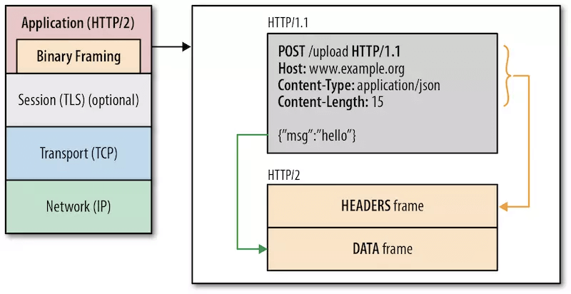
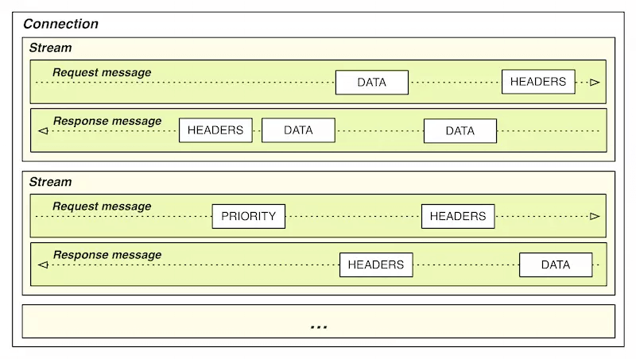

# HTTP协议的几个版本

2019 年 05 月 13 日


> HTTP协议属于计算机 7 层模型的应用层协议。

## 一、http 1.0 /  http 1.1

> 基于文本传输，http 1.0 是 1994 年创建的标准，http 1.1 是 1996 年创建的标准，并沿用至今

### 1.1  http 1.0 的缺点

1. 服务器通过 Expires 字段返回给客户端判断是否是否缓存，会因为时区的问题，造成缓存出错。

2. http 1.0 没有传递主机名，认为每台服务器都绑定唯一的 IP 地址。

3. http 1.0 发起一个请求就会建立一个 TCP 连接。

4. 每次请求都会携带 request header

5. http 1.0 需要依次请求资源，会造成阻塞。

### 1.2 两者的区别（对应 http 1.1 的优点）

#### 1.2.1 缓存处理

在 HTTP 1.0 中主要使用 header 里的 `If-Modified-Since`, `Expires` 来做为缓存判断的标准，HTTP 1.1 则引入了**更多的缓存控制策略**例如 `cache-control`，`Entity tag`，`If-Unmodified-Since`, `If-Match`, `If-None-Match` 等更多可供选择的缓存头来控制缓存策略。缓存判断的精度更高了。

#### 1.2.2 带宽优化及网络连接的使用

HTTP 1.1 则在请求头引入了 **`range`** 头域，它允许只请求资源的某个部分，即返回码是 206（Partial Content），这样就方便了开发者自由的选择以便于充分利用带宽和连接。（**支持断点续传**）

#### 1.2.3 错误通知的管理

在 HTTP 1.1 中新增了 **24 个错误状态响应码**，如 409（Conflict）表示请求的资源与资源的当前状态发生冲突；410（Gone）表示服务器上的某个资源被永久性的删除。

#### 1.2.4 Host 头处理

在 HTTP 1.0 中认为每台服务器都绑定一个唯一的 IP 地址，因此，请求消息中的 URL 并没有传递主机名（hostname）。但随着虚拟主机技术的发展，在一台物理服务器上可以存在多个虚拟主机（ Multi-homed Web Servers ），并且它们共享一个 IP 地址。**HTTP 1.1 的请求消息和响应消息都应支持 Host 头域**，且请求消息中如果没有Host头域会报告一个错误（400 Bad Request）。

#### 1.2.5 长连接

HTTP 1.1 **支持长连接（Persistent Connection）和请求的流水线**（Pipelining）处理，在一个 TCP 连接上可以传送多个 HTTP 请求和响应，减少了建立和关闭连接的消耗和延迟，在 **HTTP 1.1 中默认开启 Connection: keep-alive**，一定程度上弥补了 HTTP 1.0 每次请求都要创建连接的缺点。

## 二、http 2 （前身 SPDY ）

> HTTP/2 最大的变化是重新定义了格式化和传输数据的方式。HTTP/2 将请求和响应数据分割为更小的帧，并对它们采用二进制编码。

> 基于**二进制**传输，也叫二进制分帧。



- **帧（Frame）**：**HTTP/2 数据通信的最小单位。**帧用来承载特定类型的数据，如 HTTP 首部、负荷；或者用来实现特定功能，例如打开、关闭流。每个帧都包含帧首部，其中会标识出当前帧所属的流；

- **消息（Message）**：指 HTTP/2 中逻辑上的 HTTP 消息。例如请求和响应等，消息由一个或多个帧组成；

- **流（Stream）**：存在于连接中的一个虚拟通道。流可以承载双向消息，每个流都有一个唯一的整数 ID；

- **连接（Connection）**：与 HTTP / 1 相同，都是指对应的 TCP 连接；

- 在 HTTP/2 中，**同域名下所有通信都在单个连接上完成**，**这个连接可以承载任意数量的双向数据流。**每个数据流都以消息的形式发送，而消息又由一个或多个帧组成。多个帧之间可以乱序发送，因为根据帧首部的流标识可以重新组装。下面有一幅图说明帧、消息、流和连接的关系：



### 2.1 特点（优点）

#### 2.1.1 **多路复用**，http 2 所有的请求会共用**一个 TCP 连接**。

#### 2.1.2 **头部压缩**，http 2 客户端和服务端共同维护**一个静态字典**，用简单的代号就代替了大量的 header 数据。

#### 2.1.3 **支持服务端推送（Server Push）**，服务端主动向客户端推送数据，只需要进行一次通信就能得到全部资源。

## 三、http 3（前身 QUIC ）

> TCP 与 UDP 相比效率上存在天然的劣势，所以 2013 年 Google 开发了基于 UDP 的名为 QUIC 的传输层协议，QUIC 全称 **Quick UDP Internet Connections(快速 UDP 网络连接)**，希望它能替代 TCP，使得网页传输更加高效。后经提议，互联网工程任务组正式将基于 QUIC 协议的 HTTP （HTTP over QUIC）重命名为 HTTP/3。

### 3.1 优点

#### 3.1.1 零 RTT （往返时间）建立连接

```jsx
Step1：首次连接时，客户端发送 Inchoate Client Hello 给服务端，用于请求连接；

Step2：服务端生成 g、p、a，根据 g、p 和 a 算出 A，然后将 g、p、A 放到 Server Config 中
			 再发送 Rejection 消息给客户端；

Step3：客户端接收到 g、p、A 后，自己再生成 b，根据 g、p、b 算出 B，根据 A、p、b 算出初始密钥 K。
			 B 和 K 算好后，客户端会用 K 加密 HTTP 数据，连同 B 一起发送给服务端；

Step4：服务端接收到 B 后，根据 a、p、B 生成与客户端同样的密钥，再用这密钥解密收到的 HTTP 数据。
			为了进一步的安全（前向安全性），服务端会更新自己的随机数 a 和公钥，再生成新的密钥 S，
			然后把公钥通过 Server Hello 发送给客户端。连同 Server Hello 消息，还有 HTTP 返回数据；

Step5：客户端收到 Server Hello 后，生成与服务端一致的新密钥 S，后面的传输都使用 S 加密。

这样，QUIC 从请求连接到正式接发 HTTP 数据一共花了 1 RTT，这 1 个 RTT 主要是为了获取 Server Config，
后面的连接如果客户端缓存了 Server Config，那么就可以直接发送 HTTP 数据，实现 0 RTT 建立连接。
```

#### 3.1.2 连接维持

```jsx
TCP 连接基于四元组（源 IP、源端口、目的 IP、目的端口），切换网络时至少会有一个因素发生变化，导致连接发生变化。
当连接发生变化时，如果还使用原来的 TCP 连接，则会导致连接失败，就得等原来的连接超时后重新建立连接，
所以我们有时候发现切换到一个新网络时，即使新网络状况良好，但内容还是需要加载很久。
如果实现得好，当检测到网络变化时立刻建立新的 TCP 连接，即使这样，建立新的连接还是需要几百毫秒的时间。

QUIC 的连接不受四元组的影响，当这四个元素发生变化时，原连接依然维持。
那这是怎么做到的呢？道理很简单，QUIC 连接不以四元组作为标识，而是使用一个 64 位的随机数，
这个随机数被称为 Connection ID，即使 IP 或者端口发生变化，只要 Connection ID 没有变化，
那么连接依然可以维持。
```

#### 3.1.3 队头阻塞/多路复用

HTTP/1.1 和 HTTP/2 都存在队头阻塞问题（Head of line blocking）

```jsx
QUIC 的传输单元是 Packet，加密单元也是 Packet，整个加密、传输、解密都基于 Packet，
这样就能避免 TLS 的队头阻塞问题；
QUIC 基于 UDP，UDP 的数据包在接收端没有处理顺序，
即使中间丢失一个包，也不会阻塞整条连接，其他的资源会被正常处理。
```

#### 3.1.4 拥塞控制

TCP 的拥塞控制由 4 个核心算法组成：慢启动、拥塞避免、快速重传和快速恢复。

```jsx
慢启动：发送方向接收方发送 1 个单位的数据，收到对方确认后会发送 2 个单位的数据，
然后依次是 4 个、8 个等呈指数级增长，这个过程就是在不断试探网络的拥塞程度，超出阈值则会导致网络拥塞；

拥塞避免：指数增长不可能是无限的，到达某个限制（慢启动阈值）之后，指数增长变为线性增长；

快速重传：发送方每一次发送时都会设置一个超时计时器，超时后即认为丢失，需要重发；

快速恢复：在上面快速重传的基础上，发送方重新发送数据时，也会启动一个超时定时器，
如果收到确认消息则进入拥塞避免阶段，如果仍然超时，则回到慢启动阶段。
```

而QUIC 改进的拥塞控制的特性有：热插拔、前向纠错 FEC、单调递增的 Packet Number、ACK Delay、更多的 ACK 块、流量控制

```jsx
- 热插拔

TCP 中如果要修改拥塞控制策略，需要在系统层面进行操作。QUIC 修改拥塞控制策略只需要在应用层操作，
并且 QUIC 会根据不同的网络环境、用户来动态选择拥塞控制算法。

- 前向纠错 FEC

QUIC 使用前向纠错(FEC，Forward Error Correction)技术增加协议的容错性。
一段数据被切分为 10 个包后，依次对每个包进行异或运算，运算结果会作为 FEC 包与数据包一起被传输，
如果不幸在传输过程中有一个数据包丢失，那么就可以根据剩余 9 个包以及 FEC 包推算出丢失的那个包的数据，
这样就大大增加了协议的容错性。

- 单调递增的 Packet Number

涉及请求重传时，单调递增的 Packet Number 能确定 ACK 对应的是原始请求还是重传请求

- ACK Delay

TCP 计算 RTT 时没有考虑接收方接收到数据到发送确认消息之间的延迟，
如下图所示，这段延迟即 ACK Delay。QUIC 考虑了这段延迟，使得 RTT 的计算更加准确。

- 更多的 ACK 块

按照 TCP 的设计，每收到 3 个数据包就要“礼貌性”地返回一个 ACK。
而 QUIC 最多可以捎带 256 个 ACK block。在丢包率比较严重的网络下，
更多的 ACK block 可以减少重传量，提升网络效率。

- 流量控制
对 Connection 来说：接收窗口 = Stream1 接收窗口 + Stream2 接收窗口 + ... + StreamN 接收窗口 。
```

## 四、附录

[HTTP/3 来了 ！未来可期](https://mp.weixin.qq.com/s/B7jnJUkAFIxVmQpv1cOaYg)
