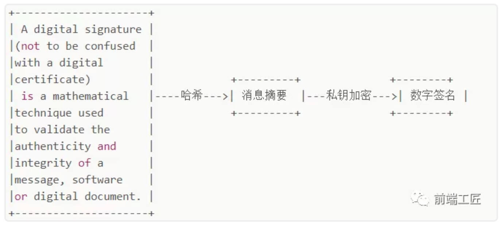
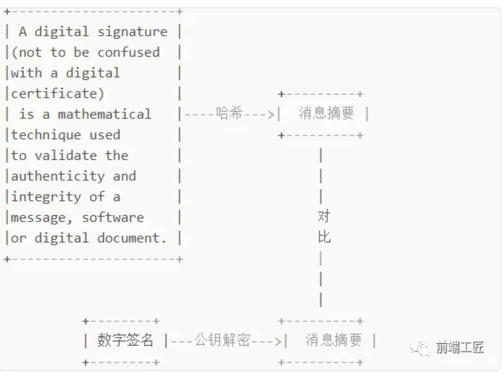
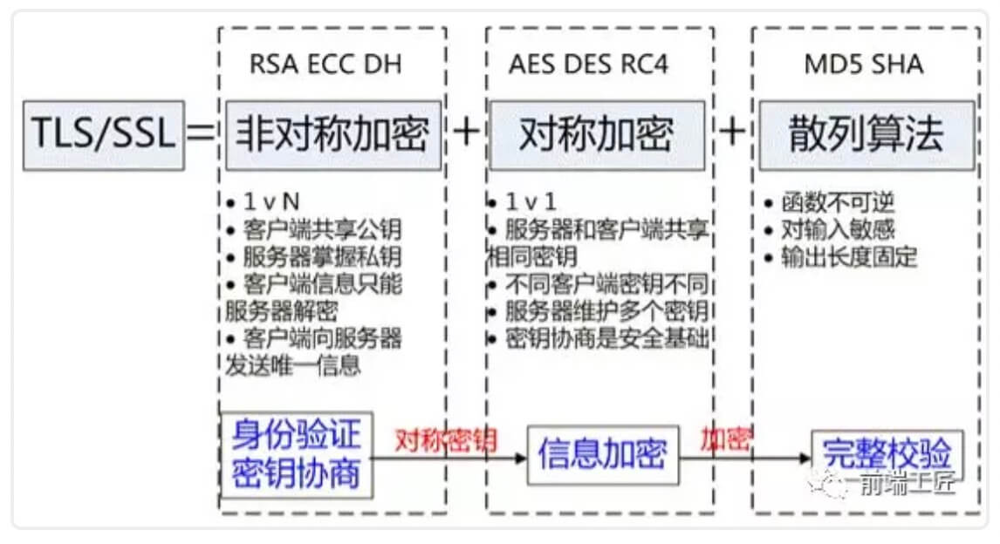
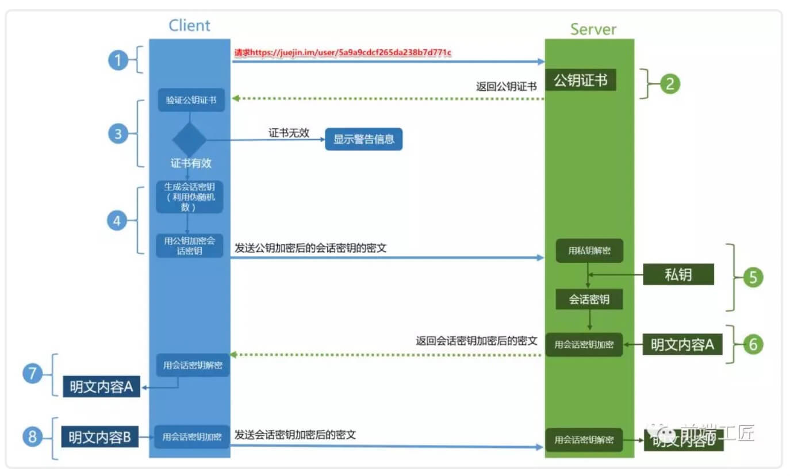
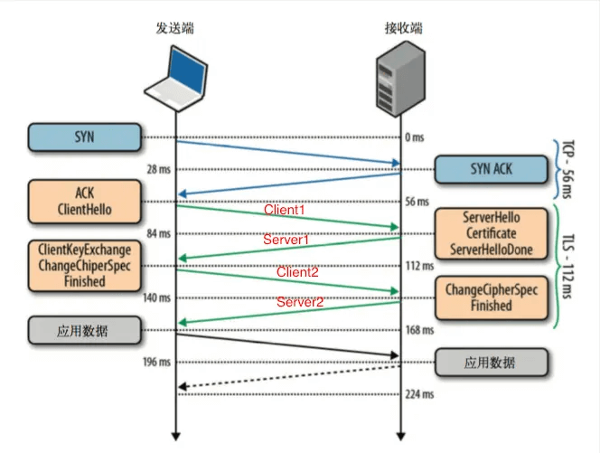

# HTTPS

> 超文本传输安全协议（英语：HyperText Transfer Protocol Secure，缩写：HTTPS；常称为 HTTP over TLS、HTTP over SSL或HTTP Secure）是一种通过计算机网络进行安全通信的传输协议。

# 一、HTTP 与 HTTPS 区别

## 1、HTTP 缺点

1. 无法证明报文的**完整性，内容会被篡改。**

2. 使用明文传输通信，**未加密，内容会被窃听。**

3. 无法验证通信方的**身份，内容可被伪装。**

## 2、HTTPS 的优势

1. **数据完整性**：内容传输经过完整性校验。

2. **数据隐私性**：内容经过对称加密，每个连接生成一个唯一的加密密钥。

3. **身份认证**：通过 SSL，第三方无法伪造通信方（服务端/客户端）身份

## 3、更多区别

1. HTTPS 比 HTTP 更加**安全**，对搜索引擎更友好，利于 **SEO**，索引 HTTPS 网页；

2. HTTPS 需要用到**SSL证书**，而 HTTP 不用；

3. HTTPS 标准**端口** 443，HTTP 标准端口 80；

4. HTTPS 基于**传输层**，HTTP 基于**应用层**；

5. HTTPS 在浏览器中显示**安全锁**，HTTP 将会显示不安全。

# 二、HTTPS 是如何实现加密

HTTPS 协议的主要功能基本都依赖于 **TLS/SSL 协议**，**TLS 是 SSL 3.0 的别名。**TLS 的功能实现主要依赖于**三类基本算法**：散列函数、对称加密和非对称加密。

## 1、散列函数：验证信息的完整性（数据完整性、防篡改、防伪装）

**MD5/SHA** 算法，在 HTTPS 中用于**生成证书数据签名、验证证书签名。**

1. **生成数字签名：**使用散列函数计算证书消息摘要，然后采用 CA 数字证书认证机构的私钥将信息摘要进行加密，密文即数字签名;

    

2. **验证证书签名：**（亦可见下文 HTTPS 工作流程）

    

## 2、对称加密：采用协商的密钥对数据加密（数据隐私性、防窃听）

1. **AES/DES/RC4** 算法、**同份密钥** 加解密

2. 在 HTTPS 中会话将随机生成对称密钥，用于**对数据内容加解密**

## 3、非对称加密：实现身份认证和密钥协商（身份认证、防伪装）

1. **RSA/ECC/DH**算法、**公钥**加密+**私钥**解密

2. 在 HTTPS 中用于**对随机对称密钥加解密**

# 三、HTTPS的工作流程

1、 `Client` 发起一个 HTTPS 请求，`Client` 默认连接 `Server` 的 443 端口；

2、 `Server` 把事先配置好的**公钥证书**返回给 `Client` （**公钥证书=公**开密**钥**+**数字签名+消息摘要**）；

3、 `Client` **验证公钥证书**，如果验证通过则继续，不通过则显示警告信息：

- 验证证书信息摘要MD5：读取证书中相关的明文信息，采用相同的**散列函数**计算得到证书的信息摘要(MD5值)；同时利用 CA 的对应公钥对**证书数字签名解密**，对比两者证书信息摘要是否匹配；
- 验证请求的站点与证书是否匹配；
- 验证证书是否在有效期内；
- 逐级验证上一级证书是否信任：直到验证到根证书（ `Client` 或者操作系统内置的 Root 证书）；

4、 `Client` 使用伪随机数生成器**生成**随机的会话**对称密钥**，然后用**证书公钥加密**这个对称密钥，并发给 `Server` （**非对称加密**）；

5、 `Server` 使用自己的**证书私钥解密**这个消息，**得到对称密钥**；至此，`Client/Server` 双方都持有了相同的对称密钥；

6、 `Server` 使用**对称密钥加密** `明文内容A`，发送给 `Client` （**对称加密**）；

7、 `Client` 使用**对称密钥解密**响应的密文，得到 `明文内容A` ；

8、 `Client` 后续再次发起 HTTPS 请求时，将使用此前的会话**对称密钥加密**请求的 `明文内容B` ，然后 `Server` 使用**对称密钥解密**密文，得到 `明文内容B` ，重复上述过程。

# 四、HTTPS的缺点

1. 证书签发到部署会比较**耗时耗力**；

2. 与纯文本通信相比，加密通信会**消耗**更多的 CPU 及内存资源，连接也会费时；

3. HTTPS 连接**缓存**不如 HTTP 高效，会增高流量成本。

# 五、附录

## 5.1 HTTPS 基于传输层，HTTP 基于应用层

`TLS`协议是基于`TCP`协议之上的，图中第一个蓝色往返是`TCP`的握手过程，之后两次橙色的往返，我们可以叫做`TLS`的握手。握手过程如下：

1. `Client1`：`TLS`版本号+所支持加密套件列表+希望使用的`TLS`选项；

2. `Server1`:   选择一个客户端的加密套件+自己的公钥+自己的证书+希望使用的`TLS`选项+（要求客户端证书）；

3. `Client2`:   (自己的证书)+使用服务器公钥和协商的加密套件加密一个对称秘钥（自己生成的一个随机值）；

4. `Server2`:   使用私钥解密出对称秘钥（随机值）后，发送加密的Finish消息，表明完成握手。

## 5.2 链接

[为什么 HTTPS 比 HTTP 更安全?](https://mp.weixin.qq.com/s/geepUXBRFXK6X8Xocp3YPw)

[详细解析 HTTP 与 HTTPS 的区别](https://juejin.im/entry/58d7635e5c497d0057fae036)