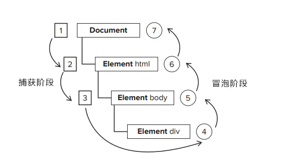

# 页面事件流

## 一、HTML 页面生命周期

### 1-1. DOMContentLoaded事件

> DOM 构建完成时的事件，图片和样式表之类的外部资源可能未加载完毕。script 标签会阻塞 DOMContentLoaded，遇则等待执行（除非具有 async 属性、或者是动态生成的脚本）

```javascript
document.addEventListener("DOMContentLoaded", () => {});
```

### 1-2. load事件

所有资源加载完成的事件。

```javascript
window.onload = () => {};
```

### 1-3. beforeunload / unload事件

用户正在离开 / 用户几乎已经离开的可监听事件。

```javascript
window.onbeforeunload = () => {};

window.onunload = () => {};
```

### 1-4. readystatechange事件

跟踪文档加载状态的事件。

```javascript
document.addEventListener('readystatechange', () => console.log(document.readyState));
```

### 1-5. 总结

- 当 DOM 准备就绪时，`document` 上的 `DOMContentLoaded` 事件就会被触发。在这个阶段，我们可以将 JavaScript 应用于元素。

    - 诸如 `<script>...</script>` 或 `<script src="..."></script>` 之类的脚本会阻塞 `DOMContentLoaded`，浏览器将等待它们执行结束。

    - 图片和其他资源仍然可以继续被加载。

- 当页面和所有资源都加载完成时，`window` 上的 `load` 事件就会被触发。我们很少使用它，因为通常无需等待那么长时间。

- 当用户想要离开页面时，`window` 上的 `beforeunload` 事件就会被触发。如果我们取消这个事件，浏览器就会询问我们是否真的要离开（例如，我们有未保存的更改）。

- 当用户最终离开时，`window` 上的 `unload` 事件就会被触发。在处理程序中，我们只能执行不涉及延迟或询问用户的简单操作。正是由于这个限制，它很少被使用。我们可以使用 `navigator.sendBeacon` 来发送网络请求。

- `document.readyState` 是文档的当前状态，可以在 `readystatechange` 事件中跟踪状态更改：

    - `loading` —— 文档正在被加载。
    - `interactive` —— 文档已被解析完成，与 `DOMContentLoaded` 几乎同时发生，但是在 `DOMContentLoaded` 之前发生。
    - `complete` —— 文档和资源均已加载完成，与 `window.onload` 几乎同时发生，但是在 `window.onload` 之前发生。

## 二、常见的事件流、事件模型

### 2-1. 5 种事件处理程序（事件侦听器）

1. **HTML 事件处理程序**

    ***直接在 html 代码中给元素绑定事件处理程序***

    - 缺点：HTML 和 JavaScript 代码**耦合度高**、作用域链在不同的浏览器中会导致不同的结果（**兼容**）、**时差**问题（若事件脚本在 script 标签中未完全加载，会报错。）**暴露在 HTML 代码中（被当成元素一个属性）**。
    - 优点：清晰
2. **DOM0 级事件处理程序**

    ***在 script 里面先获取到目标元素，再给目标元素绑定事件处理程序，如 $('button').onclick = func，通过 $('button').onclick = null 即可删除事件处理程序。***

    - 优点：不会有 HTML 事件处理程序带来的问题。
    - 缺点：**不能**给一个元素**同时添加**两个事件，（相同事件会**被覆盖**）、**不能控制元素的事件流**（捕获or冒泡）。
3. **DOM2 级事件处理程序**

    ***在 script 里面先获取到目标元素，通过 addEventListener 给目标元素添加事件处理程序，通过 removeEventListener  删除事件处理程序。（3 个参数），this 指向目标元素***

    - 优点：同一元素可以添加多个事件处理程序，并且事件处理程序按照**定义顺序**依次触发。
    - 缺点：
    - 注意：***removeEventListener 无法删除事件处理程序是匿名函数的情况，需要删除则需定义成具名函数***
4. **IE 事件处理程序**

    ***在 script 里面先获取到目标元素，通过 attachEvent 给目标元素添加事件处理程序，通过 detachEvent  删除事件处理程序。（2 个参数），this 指向 window***

    - 优点：
    - 缺点：
    - 注意：***DOM2不同，事件触发的顺序不是添加的顺序而是添加顺序的相反顺序。***
5. **跨浏览器事件处理程序**

    定义一个工具函数，可兼容不同浏览器的事件处理程序。我们利用柯里化函数定义此工具函数，***先判断 DOM2 级事件处理程序，再判断 IE 事件处理程序，最后使用 DOM0 级事件处理程序。***

    ```javascript
    const EventUtil = {
    	addHandler() {
    		if (window.addEventListener) {
    			return function(el, type, handler) {
    				el.addEventListener(type, handler, false);
    			};
    		}
    		else if(window.attachEvent) {
    			return function(el, type, handler) {
    				el.attachEvent(`on${type}`, handler);
    			};
    		}
    		else {
    			return function(el, type, handler) {
    				el[`on${type}`] = handler;
    			}
    		}
    	},
    	removeHandler() {
    		if (window.removeEventListener) {
    			return function(el, type, handler) {
    				el.removeEventListener(type, handler, false);
    			};
    		}
    		else if(window.detachEvent) {
    			return function(el, type, handler) {
    				el.detachEvent(`on${type}`, handler);
    			};
    		}
    		else {
    			return function(el, type, handler) {
    				el[`on${type}`] = null;
    			}
    		}
    	},
    };

    // 怎么使用

    const addEvent = EventUtil.addHandler();
    const removeEvent = EventUtil.removeHandler();

    function handleH2() {
    	alert('h2');
    }

    addEvent(h2, 'click', handleH2);
    // removeEvent(h2, 'click', handleH2);
    ```

### 2-2. 事件流

> 事件流描述的是页面接受事件的顺序。

DOM2 级事件规定的事件流包括三个阶段：***事件捕获阶段、处于目标阶段、事件冒泡阶段***。



### 2-2-1. 事件捕获

事件开始由**不太具体的节点**接收，然后逐级**向下传播**到最具体的节点。它与事件冒泡是个相反的过程。

### 2-2-2. 事件冒泡

事件开始由**最具体的元素**接收，然后逐级**向上传播**到较为不具体的节点（或文档）

### 2-2-3. 嵌套元素且都绑定了多个事件处理程序

如果页面上有存在嵌套层级关系的元素，且都绑定了多个事件处理程序，当我们点击某元素时，

- 它的**容器元素和嵌套元素**，按 **DOM 事件流的顺序** 执行事件处理程序。**（先捕获再冒泡）**

- 当该元素**处于目标阶段**时，事件调用顺序决定于绑定事件的**书写顺序。(谁写在前谁先被触发)**

### 2-3. 事件对象

- currentTarget
- preventDefault
- stopPropagation
- target

## 三、实战

### 3.1 事件委托

> 将元素的事件委托给它的父级或者更外级元素处理。**利用事件冒泡机制**。

### 3.1.1 优点

1. 节约内存，给每个列表项都绑定事件，消耗内存。

2. 动态增加时，无需给新增的元素绑定事件。

3. 部分浏览器移除元素时，绑定的事件并没有被及时移除，导致的内存泄漏，严重影响性能。

### 3.1.2 缺点

1. 不支持事件冒泡的事件用不了事件委托，例如 blur、focus、load、unload 、以及自定义的事件不支持冒泡。

2. mouseover 和 mouseout 事件需要经常计算鼠标的位置，比较麻烦。

### 3.1.3 注意

不恰当的使用也会造成性能瓶颈

1. 尽量的减少绑定的层级，如不在 body 元素上，进行绑定

2. 减少绑定的次数，添加自定义属性选择器