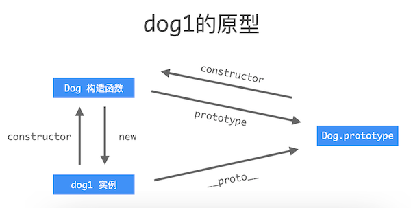
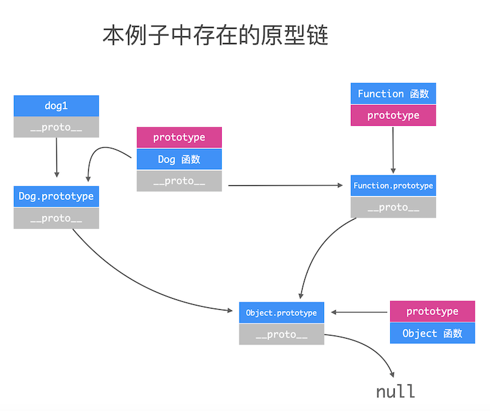
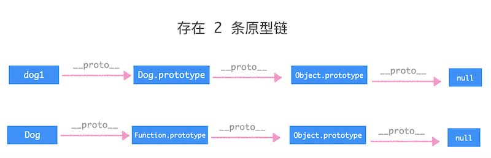

# 原型和原型链

## 一、原型

> **在一个对象的基础上，创建新对象。在此过程中，作为`基础对象`的对象被称为`原型`。**

### 1、`__proto__`

> 每个对象都会有这个属性，代表原型指向。

### 2、`prototype`

> 只有函数才有这个属性，代表所有实例对象可共享的属性以及方法。

## 二、原型链

> **通过 `__proto__` 把对象之间的继承关系串起来的“链子”被称为原型链。**

## 三、一个例子说明原型和原型链

```javascript
const Dog = (name) => {
    this.name = name;
    this.bark = () => {
        console.log('wang wang wang');
    }
}

// 以构造函数的形式，创建实例
const dog1 = new Dog('小白');
```

那么 `dog1` 和 `Dog`、`Dog.prototype` 的关系是：



```javascript
dog1.__proto__ === Dog.prototype     // true
dog1.constructor === Dog             // true
Dog.prototype.constructor === Dog    // true
```





