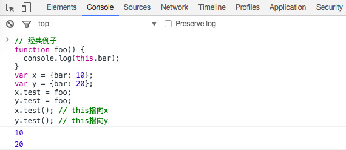

# This

2017年09月26日

> JavaScript采用的是`词法作用域`，即在`函数创建后，就会构建自己的执行环境和确定作用域`（除了欺骗作用域的 eval和 with可以改变）

## 定义

This是`执行上下文环境的一个属性`，而不是某个变量对象的属性，也不是变量

This值在`进入上下文时确定`，并且在`上下文运行期间不变`，`不会从作用域链中搜寻`。

This会由每一次caller提供，caller是通过`调用表达式[call expression]产生`的（也就是这个函数如何被激活调用的）。

## 不同位置的This

### 全局代码中的this

this始终是全局对象本身

### 函数代码中的this

> 它不是静态的绑定到一个函数，取决于该函数被调用的方式。

一些文章写到，甚至是在关于javascript的书籍中看到，它们声称：`this值取决于函数如何定义，如果它是全局函数，this设置为全局对象，如果函数是一个对象的方法，this将总是指向这个对象。–这绝对不正确`

```javascript
var foo = {x: 10};
var bar = {
  x: 20,
  test: function () {
    alert(this === bar); // true
    alert(this.x); // 20
    this = foo; // 错误，任何时候不能改变this的值
    alert(this.x); // 如果不出错的话，应该是10，而不是20
  }
};
bar.test(); // true, 20
foo.test = bar.test;
// 不过，这里this依然不会是foo，尽管调用的是相同的function
foo.test(); // false, 10
  
function foo() {
  alert(this);
}
foo(); // global
alert(foo === foo.prototype.constructor); // true
// 但是同一个function的不同的调用表达式，this是不同的 为什么呢？
foo.prototype.constructor(); // foo.prototype
  
var foo = {
  bar: function () {
    alert(this);
    alert(this === foo);
  }
};
foo.bar(); // foo, true
var exampleFunc = foo.bar;
alert(exampleFunc === foo.bar); // true
// 再一次，同一个function的不同的调用表达式，this是不同的  又为什么呢？
exampleFunc(); // global, false
```

这里就跟引用类型（Reference type）有关了，调用函数时，调用括号()的左边是引用类型的值，this将设为引用类型值的base对象（base object），在其他情况下（与引用类型不同的任何其它属性），这个值为null

引用类型的值可以表示为一个对象，它拥有两个属性（base（拥有属性的那个对象），propertyName）

```javascript
var valueOfReferenceType = {
  base: <base object>,
  propertyName: <property name>
};
```

引用类型的值只有两种情况：
当我们处理一个标示符时
或一个属性访问器（. 和 [] 运算符）

通过内部的[[Get]]方法返回对象属性真正的值。

```javascript
function foo() {
  alert(this);
}
foo(); // this指向global(base: global,propertyName: 'foo')
foo.prototype.constructor(); // this指向foo.prototype
// (base:  foo.prototype,propertyName: 'constructor')
 
var bar = {
  baz: foo
};
bar.baz(); // this指向bar(base: bar,propertyName: 'baz')
// 当调用括号的左边不是引用类型而是其它类型，base自动设置为null，结果为全局对象。
(bar.baz)(); // this指向bar，组运算符返回仍然是一个引用类型
(bar.baz = bar.baz)(); // global(括号内返回函数对象)
(bar.baz, bar.baz)(); // global(括号内返回函数对象)
(false || bar.baz)(); // global(括号内返回函数对象)
```

```javascript
var otherFoo = bar.baz;
otherFoo(); // global(base: global,propertyName: 'otherFoo')
```



构造器调用的函数中的this

所有相同的函数都将this的值设置为新创建的对象。

```javascript
function A() {
  alert(this); // "a"对象下创建一个新属性
  this.x = 10;
}
var a = new A();
alert(a.x); // 10
```

函数调用中手动设置this

`.apply(this,[])`

`.call(this,arguments,arguments)`