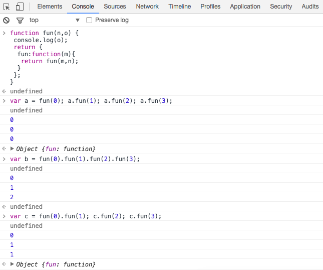

# 闭包

2017年3月17日

> JS中的变量 分为 全局变量 和 局部变量。

> 在函数外部 无法获取 函数内的局部变量

> ```javascript
>function f1(){
>　var n=999;
>}
>alert(n); // error
> ```

## 怎样从外部读取局部变量?

在函数的内部，再定义一个函数。让内部函数去访问局部变量。

```javascript
function f1(){
  var n=999;
  function f2(){
    alert(n); // 999
  }
}
```

JS特有的“链式作用域”，子对象会一级一级地向上寻找所有的父对象的变量。

所有父对象的所有变量，对子对象都是可见的。

既然f2可以读取f1中的局部变量，那么只要把f2作为返回值，我们不就可以在f1外部读取它的内部变量了吗?

```javascript
function f1(){
  var n=999;
  function f2(){
    alert(n);
  }
　return f2;
}
var result = f1();
result(); // 999
```

f2 就是闭包，是一个能够读取其他函数内部变量的函数。

## 什么是闭包？

读取函数内部的变量。
这些变量的值始终保持在内存中。

```javascript
function f1(){
  var n = 999;
  nAdd = function(){n+=1}
    function f2(){
      alert(n);
  }
  return f2;
}
var result=f1();
result(); // 999
nAdd();
result(); // 1000
```

f2 被赋值给result全局变量，导致f2一直在内存中，又因为f2一直依赖f1，f1也始终在内存中，不会在调用结束后被垃圾回收机制回收。

nAdd 没有var声明，是一个全局变量。其次它的值是一个匿名函数，函数本身是一个闭包，可以在函数外部对函数内部的局部变量的进行操作。

## 注意事项

1. 由于闭包会使得函数中的变量都被保存在内存中，内存消耗很大，所以不能滥用闭包，否则会造成网页的性能问题，在IE中可能导致内存泄露。解决方法是，在退出函数之前，将不使用的局部变量全部删除。
2. 闭包会在父函数外部，改变父函数内部变量的值。所以，如果你把父函数当作对象（object）使用，把闭包当作它的公用方法（Public Method），把内部变量当作它的私有属性（private value），这时一定要小心，不要随便改变父函数内部变量的值。

## 思考题

```javascript
var name = "The Window";
var object = {
  name : "My Object",
  getNameFunc : function(){
    return function(){
      return this.name;
    };
  }
};
alert(object.getNameFunc()());
// object.getNameFunc()为 return function(){} 此时在全局作用域下，this指向全局，name为“the window”
var name = "The Window";
var object = {
  name : "My Object",
  getNameFunc : function(){
    var that = this;
    return function(){
      return that.name;
    };
  }
};
alert(object.getNameFunc()());
// object.getNameFunc()为return function(){} 先前将this赋值给that了，name为“My Object”
```

## 面试题目

```javascript
function fun(n,o) {
  console.log(o);
  return {
  fun: function(m){
    return fun(m,n);
  }
 };
}
var a = fun(0); a.fun(1); a.fun(2); a.fun(3);
// a = fun (0) = { fun: function(m){return fun(m,0)} }
// a.fun(1) = fun(1,0);
// a.fun(2) = fun(2,0);
// a.fun(3) = fun(3,0)
var b = fun(0).fun(1).fun(2).fun(3);
// fun(0).fun(1) = fun(1,0) = {fun: function(m){return fun(m,1)}}
// fun(0).fun(1).fun(2) = fun(2,0) = {fun: function(m){return fun(m,2)}}
var c = fun(0).fun(1); c.fun(2); c.fun(3);
// c = fun(1,0) = {fun: function(m){return fun(m,1)}}
```

## 面试题的答案
