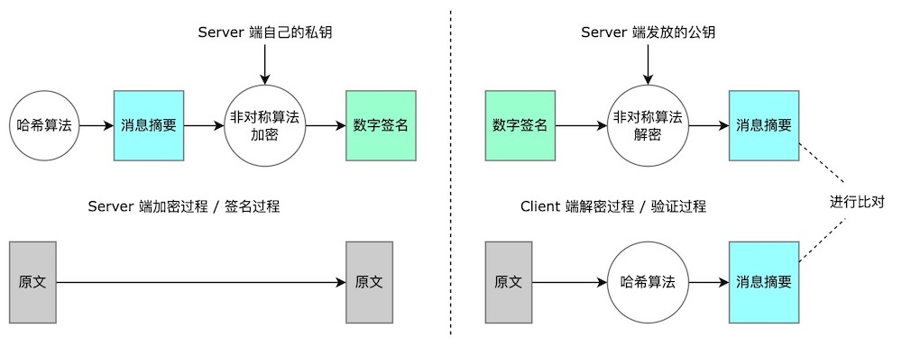
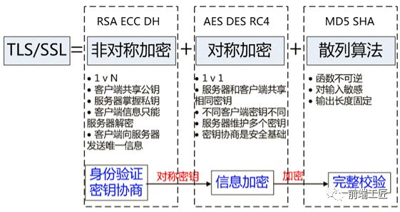

# HTTPS

> 超文本传输安全协议（英语：HyperText Transfer Protocol Secure，缩写：HTTPS；

> 常称为HTTP over TLS、HTTP over SSL 或 HTTP Secure）是一种通过计算机网络进行安全通信的传输协议。

# 一、HTTP 与 HTTPS 区别

## 1.1 HTTP 缺点

### 内容可能会被窃听：`使用明文传输通信，未加密`

### **内容可能会被篡改：**`无法证明报文的完整性`

### 内容可能会被伪装：`无法验证通信方的身份`

## 1. 2 HTTPS 的优势（对应 HTTP 缺点）

### 保证数据完整性：`内容传输经过完整性校验`

### 保证数据隐私性：`内容经过对称加密，每个连接生成一个唯一的加密密钥`

### 进行身份认证：`通过 SSL，第三方无法伪造通信方（服务端/客户端）身份`

## 1.3 更多区别

### 端口不同：`HTTPS 标准端口 443，HTTP 标准端口 80`

### 证书：`HTTPS 需要用到 SSL 证书，而 HTTP 不用`

### SEO：`HTTPS 比 HTTP 更加安全，对搜索引擎更友好，利于 SEO，索引 HTTPS 网页`

### 标识：`HTTPS 在浏览器中显示安全锁，HTTP 将会显示不安全`

# 二、HTTPS 是如何实现加密

HTTPS 协议的主要功能基本都依赖于 **SSL 协议**

SSL 的功能实现主要依赖于 **3 类基本算法**：哈希算法、对称加密和非对称加密。

TLS 是 SSL 3.0 的别名。

## 2.1 哈希算法：验证消息摘要的完整性

> 哈希算法（散列算法或者消息摘要算法）是信息存储和查询所用的一项基本技术，它是一种基于**Hash函数**的文件构造方法，可实现对记录的快速随机存取。 它把给定的任意长关键宇映射为一个固定长度的哈希值，一般用于鉴权、认证、加密、索引等。
> 

典型的哈希算法包括 MD2、MD4、MD5 和 SHA-1（安全哈希算法）。哈希算法也称为“哈希函数”。

用于保证数据完整性，防伪装。在 HTTPS 中用于**生成证书数字签名、验证证书数字签名。**

1. **生成数字签名：**使用哈希算法计算证书消息摘要，然后采用 CA 数字证书认证机构的私钥将信息摘要进行加密，密文即数字签名，发生在服务端的。
2. **验证数字签名：**客户端采用同样的哈希算法计算得到消息摘要，并使用公钥解密数字签名，二者进行比对，发生在客户端的。

## 2.2 对称加密：对数据内容加密

保证数据隐私性，防窃听

1. **同份密钥**加解密，常见算法如 **AES / DES / RC4** 算法
2. 在 HTTPS 会话中将随机生成**对称密钥**，用于**对数据内容加解密。**

## 2.3 非对称加密：实现身份认证和传递随机对称密钥

进行身份认证，防伪装和防篡改。

1. **公钥**加密+**私钥**解密，常见算法如 **RSA / ECC / DH** 算法
2. 在 HTTPS 中用于对 **随机对称密钥 加解密。**

# 三、HTTPS 的工作流程

1、 `Client` 发起一个 HTTPS 请求，`Client` 默认连接 `Server` 的 443 端口；

2、`Server` 把事先配置好的**公钥证书**返回给 `Client` （公钥证书=公开密钥 + 数字签名 + 消息摘要）；

3、 `Client` **验证公钥证书**，如果验证通过则继续，不通过则显示警告信息：

   - 验证证书消息摘要：读取证书中相关的明文信息，采用相同的哈希算法计算得到证书的消息摘要；同时使用 CA 的对应公钥对**数字签名进行解密**，对比两者消息摘要是否匹配；    
   - 验证请求的站点与证书是否匹配；
   - 验证证书是否在有效期内；
   - 逐级验证上一级证书是否信任：直到验证到根证书（ `Client` 或者操作系统内置的 Root 证书）；

4、 `Client` 使用伪随机数生成器**生成**随机的会话**对称密钥**，然后用**证书公钥加密**这个对称密钥，并发给 `Server` （**非对称加密**）；

5、 `Server` 使用自己的**证书私钥解密**这个消息，**得到对称密钥**；至此，`Client/Server` 双方都持有了相同的对称密钥；

6、 `Server` 使用**对称密钥加密** `明文内容A`，发送给 `Client` （**对称加密**）；

7、 `Client` 使用**对称密钥解密**响应的密文，得到 `明文内容A` ；

8、 `Client` 后续再次发起 HTTPS 请求时，将使用此前的会话**对称密钥加密**请求的 `明文内容B` ，然后 `Server` 使用**对称密钥解密**密文，得到 `明文内容B` ，重复上述过程。

# 四、HTTPS 的缺点

## 4.1 时间更长

1. 证书签发到部署会比较`耗时耗力`
2. 与纯文本通信相比，加密通信会`消耗更多的 CPU 及内存资源`，`连接`也会`费时`；

## 4.2 流量成本增加

1. `HTTPS 连接缓存不如 HTTP 高效`，会增高流量成本。

# 五、⭐️⭐️ 抓包工具是如何绕过 HTTPS 的

如 Whistle，是基于 “中间人攻击” 原理绕过的

中间人截取客户端发送给服务器的请求，然后伪装成客户端与服务器进行通信；将服务器返回给客户端的内容发送给客户端，伪装成服务器与客户端进行通信。 通过这样的手段，便可以获取客户端和服务器之间通信的所有内容。 使用中间人攻击手段，必须要让客户端信任中间人的证书。

让客户端信任中间人的证书有 2 种方案：

1. 客户端安装 Whistle 的根证书
2. 客户端不需要安装 Whistle 的根证书，Nohost服务器安装业务域名真实的证书，这样Nohost服务器可以充当“真实”服务器

# 六、附录

[为什么 HTTPS 比 HTTP 更安全?](https://mp.weixin.qq.com/s/geepUXBRFXK6X8Xocp3YPw)

[详细解析 HTTP 与 HTTPS 的区别](https://juejin.im/entry/58d7635e5c497d0057fae036)