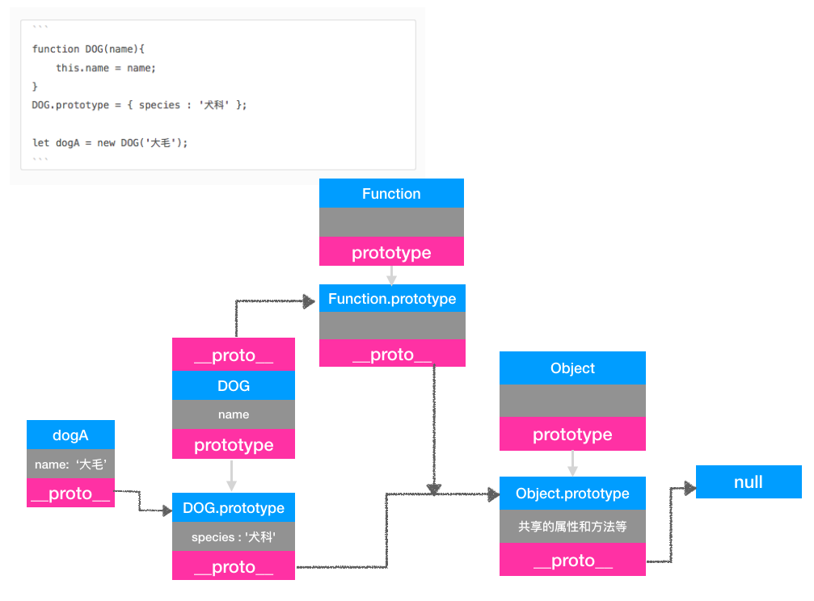
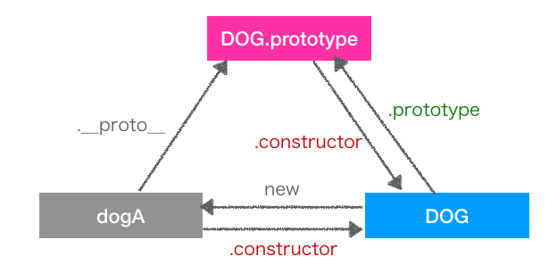

# 原型,原型链,继承,构造函数,实例

2017 年 03 月 08 日

## 原型链

每个对象都会在内部初始化一个属性，就是 `prototype`，当我们访问一个对象的属性时，如果这个对象内部不存在这个属性，就会去 `prototype` 里找这个属性，这个 `prototype` 又会有自己的 `prototype`，这样就有原型链的概念了。

## 继承

Java 中：指在已有的一个类基础上创建新类的过程。

ECMAScript：指在 **一个对象的基础上** 创建 新对象 的过程。原型指 **在这过程中作为基础的对象**。

## 原型

> 是对象的一个内部属性，属性名为`__proto__` （表现）

ECMAScript 实现继承的过程中产生的一个概念。

## 创建原型

```javascript
var bird = {
  name: 'bird',
  fly: function() {
    console.log('fly');
  },
};
var eagle = Object.create(bird);
eagle.fly();
```

通过 `Object.create()` 方法我们传入了鸟 `bird` 对象，作为 **鹰对象的原型** 来创建鹰对象，然后鹰对象中就产生了一个叫 `__proto__` 的指针，这指针指向鸟对象。通过这个指针鹰对象就可以访问到鸟对象的 `fly` 方法。

```javascript
eagle.__proto__ === bird; // true
// 而bird的__proto__又指向谁呢？
bird.__proto__ === Object; // ?
bird.__proto__ === Object.prototype; // ?
```

```javascript
function DOG(name) {
  this.name = name;
  this.species = '犬科';
}
var dogA = new DOG('大毛');
var dogB = new DOG('二毛');

dogA.name; // 大毛
dogA.species; // 犬科
dogB.name; // 二毛
dogB.species; // 犬科

dogA.species = '猫科';
dogB.species; // 犬科

// 实例对象的 属性和方法 只能被本身改变，不能共享。
```

```javascript
function DOG(name) {
  this.name = name;
}
DOG.prototype = { species: '犬科' };

var dogA = new DOG('大毛');
var dogB = new DOG('二毛');
dogA.species; // 犬科
dogB.species; // 犬科

DOG.prototype.species = '猫科';
dogA.species; // 猫科
dogB.species; // 猫科

// 通过prototype将所有实例对象需要共享的属性和方法放在这里
```

## `__proto__`

每个对象都会有这个属性

## prototype

只有函数才有这个属性

## 原型,原型链关系图



## 构造函数关系图



```javascript
dogA.__proto__ === DOG.prototype; // true
dogA.__proto__.constructor === DOG; // true
dogA.constructor === DOG; // true
dogA.constructor.prototype === DOG.prototype; // true
```
