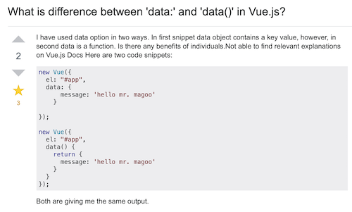

# Vue.js 常见问题整理

2018 年 10 月 01 日

### 1. data: {} 和 data() { return {}; }的区别

[官网文档是这样解释的](https://cn.vuejs.org/v2/api/index.html#data)

后者写法是为了 避免组件复用 时，多个实例共享引用同一个数据对象。

### 2. ajax 是异步请求，props传值问题

父子组件通过 `props` 传值时，子组件渲染的 `template` 数据会自动响应 `props`

但若在生命周期函数中进行 `props` 处理，只能拿到 `props` 第一次的值。

子组件在生命周期函数中，取值会出现 `Cannot read property 'some' of undefined` 问题

  * 父组件传值进行 `v-if` 判断

  * 子组件使用 `watch` 来监听 `props`，使用 `methods` 来代替 生命周期 处理业务逻辑
