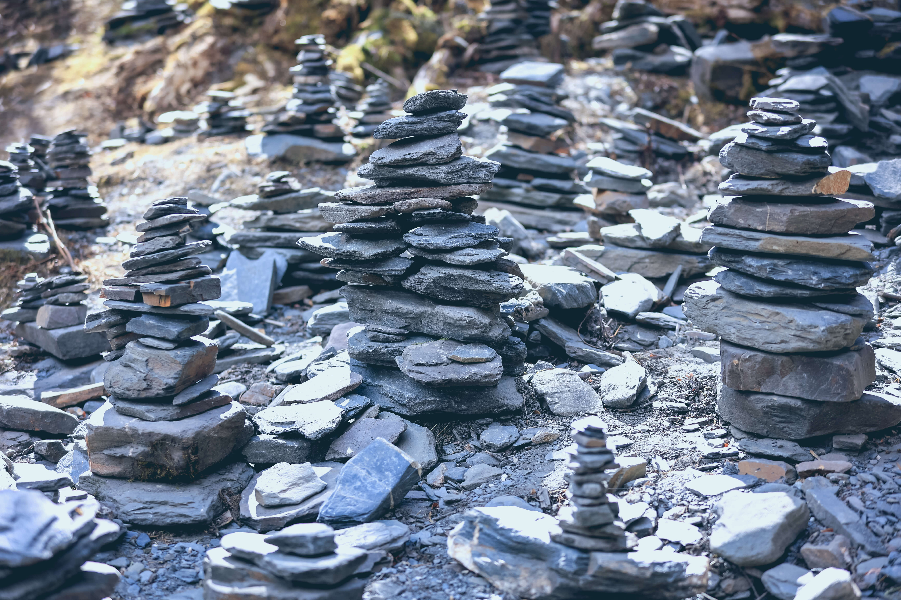

# 四姑娘山

> “ 四姑娘山以雄峻挺拔闻名，山体陡峭，直至蓝天，冰雪覆盖，银光照人。山麓森林茂密，绿草如茵，清澈的溪流潺潺不绝，宛如一派秀美的南欧风光，人称“东方的阿尔卑斯”。（来自官网介绍）”

2023年2月份上旬跟着公司团建去过一次，正值冬天，最高3℃，最低-8℃，海拔高度在 3200 米左右，主要游玩了长坪沟景区，沿着木头栈道走走停停到返回酒店花了两小时，一路真的好干净呢，期待春暖花开的时候再来一次，满山翠绿应该更漂亮。

## 实拍图

山峰

斯古拉寺与蓝天白云

石头

打卡地

藏族特色晚餐

结冰的路面

长坪沟景区内摆拍

