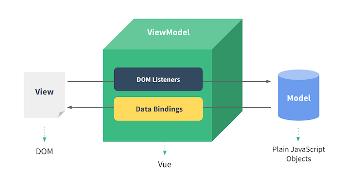
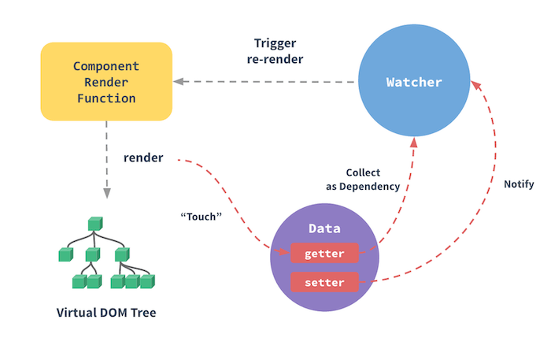

# Vue.js 如何利用观察者模式完成数据双向绑定

?> 观察者模式：一个对象（被观察者）的状态发生改变时，会通知所有依赖它的对象（观察者），从而触发所有观察者各自的更新函数。

> 举例：在苹果门店前排队买最新iPhone的客人就是若干个观察者，苹果门店就是被观察者。

## 一、自己设计实现观察者模式

### 1-1. 分解观察者模式的角色

`多个观察者`、`一个被观察者`

### 1-2. 观察者模式的各个角色具有的方法

`观察者`：update

`被观察者`：add，remove，notify

### 1-3. 代码实现

```javascript
// 被观察者
class Subject {
  constructor() {
		this.observers = [];
	}
	// 收集观察者
	add(person) {
		this.observers.push(person);
	}
	// 移除指定观察者
	remove(person) {
		// 找到索引
		let index = this.observers.findIndex(e => person.name === e.name);
		index > -1 && this.observers.splice(index, 1);
	}
	// 派发更新给所有的观察者
	notify(data) {
		this.observers.forEach(e => e.update(data));
	}
}
// 观察者
class Observer {
	constructor(name) {
		this.name = name;
	}
	update(data) {
		console.log(`${this.name}收到通知了，“${data}”...`);
	}
}

const appleStore = new Subject(); // 某家苹果门店
const observer1 = new Observer('hui1'); // 排在第一位的客户
const observer2 = new Observer('hui2'); // 排在第二位的客户
appleStore.add(observer1);
appleStore.add(observer2);

// 5秒后派发更新给所有的观察者
setTimeout(function() {
	appleStore.notify('iPhone11到货了, 有1个名额');  // 会执行 observer1.update，observer1.update
}, 5000);

// 10秒后派发更新给所有的观察者
setTimeout(function() {
	appleStore.remove(observer2); // 维护秩序的保安：“排在第二位的客户不买了，已经走人，收到请回答”
	appleStore.notify('iPhone12到货了, 有10个名额'); // 会执行 observer1.update
}, 10000);
```

## 二、Vue.js

官方文档上晒过一张图，表示 `Vue` 核心部分是 `MVVM` 框架中的 `ViewModel` 层，用于数据绑定，监听 `DOM` 中的事件，已达到“视图交互触发数据更新，数据变更驱动视图更新” 的目的。



那 ViewModel 层是如何实现数据驱动视图的呢？官方也有一张图说明，即在组件执行 render 函数时，（生成 Virtual DOM Tree 时），会将使用到的数据（Touch）对象通过 Object.defineProperty 转换成 getter 和 setter 函数，调用 getter 函数时收集至 Watcher 依赖池，触发 setter 函数时通知 Watcher 依赖池进行 re-render 操作。



利用观察者模式完成数据双向绑定。

### 2-1. 新建一个 DiyVue 类

```javascript
class DiyVue {
  /*
  * 构造函数，接收一个对象作为参数
  * options {Object}
  */
  constructor(options) {
    this.options = options;
    this.$el = document.querySelector(options.el);
    this.$data = options.data;
    // 指令与 watcher 依赖池
    this._directives = {};
    // 数据劫持
    this._observe(this.$data);
    // 编译器，将 DOM 中的指令提取出来, 并初始化依赖池
    this._compile(this.$el);
  }
  /*
  * 编译器，遍历 DOM，收集依赖
  */
  _compile(root) {
    const nodes = root.children;
    const nodesLength = nodes.length;
    for (let i = 0; i < nodesLength; i++) {
      const node = nodes[i];
      if (node.children && node.children.length) this._compile(node.children);
      const tagName = node.tagName.toLowerCase();
      if (node.hasAttribute('v-innerhtml')) {
        const attrBindValue = node.getAttribute('v-innerhtml');
        this._directives[attrBindValue].push(new Observer(node, 'innerHTML', attrBindValue, this));
      }
      if (node.hasAttribute('v-model') && tagName === 'input' || tagName === 'textarea') {
        const attrBindValue = node.getAttribute('v-model');
        // 在事件处理程序中，this 会指向当前的 DOM 元素，这里要先把外部的 this 存储起来，供在事件处理程序内部能正常调用
        const _this = this;
        node.addEventListener('input', (function () {
          _this._directives[attrBindValue].push(new Observer(node, 'value', attrBindValue, _this));
          return function () {
            // 更新 $data 中的值
            _this.$data[attrBindValue] = node.value;
          };
        })());
      }
    }
  }

  /*
  * 数据对象转换成 getter 和 setter
  */
  _observe(data) {
    for (let key in data) {
      let value = data[key];
      if (data.hasOwnProperty(key)) {
        this._directives[key] = [];
      }
      if (typeof value === 'object') this._observe(value);
      // 当前数据的依赖池（即和哪些 DOM 元素接触关系）
      let _dir = this._directives[key];
      Object.defineProperty(data, key, {
        enumerable: true,
        configurable: true,
        get: () => value,
        set: (newValue) => {
          if (value !== newValue) {
            value = newValue;
            _dir.forEach(e => e._update());
          }
        },
      });
    }
  }
}
```

### 2-2. 新建一个 Observer 类

```javascript
// 观察者
class Observer {
  /*
  * el {String} 指令作用的 DOM 元素
  * nativeAttrName {String} 作用于原生 DOM 的属性名称
  * key {String} 声明在数据中的属性名
  * vm {Object} DiyVue 实例
  */
  constructor(el, nativeAttrName, key, vm) {
    this.el = el;
    this.nativeAttrName = nativeAttrName;
    this.key = key;
    this.vm = vm;
    this._update();
  }
  _update() {
    // 更新 DOM 中的值
    this.el[this.nativeAttrName] = this.vm.$data[this.key];
  }
}
```

### 2-3. 实验一下

```html
<div id="app">
    <h3>用 JavaScript 观察者模式实现 Vue 2.x 的双向绑定</h3>
    <h4>输入框与P</h4>
    <input v-model="value1" />
    <p v-innerhtml="value1"></p>
    <br />
    <h4>文本框与SPAN</h4>
    <textarea v-model="value2"></textarea>
    <br />
    <span v-innerhtml="value2"></span>
    <p style="color: darkgray;">打开 Chrome Devtools 查看 DiyVue 和 Observer 类是如何实现的</p>
</div>
```

```javascript
const vm = new DiyVue({
    el: '#app',
    data: {
        value1: '123',
        value2: '456',
    },
});

console.log('init:', `vm.$data.value1: ${vm.$data.value1}`, `vm.$data.value2: ${vm.$data.value2}`);

setTimeout(() => {
    vm.$data.value1 = '2秒后，123我变了';
    console.log('value1 changed:', `vm.$data.value1: ${vm.$data.value1}`, `vm.$data.value2: ${vm.$data.value2}`);
}, 2000);

setTimeout(() => {
    vm.$data.value2 = '4秒后，456我变了';
    console.log('value2 changed:', `vm.$data.value1: ${vm.$data.value1}`, `vm.$data.value2: ${vm.$data.value2}`);
}, 4000);
```

### 2-4. 线上地址演示