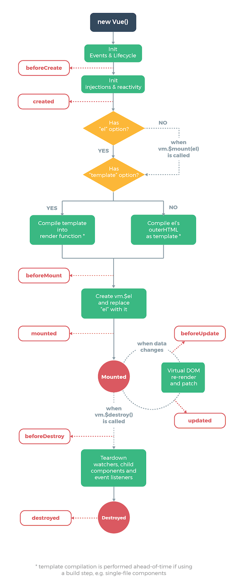
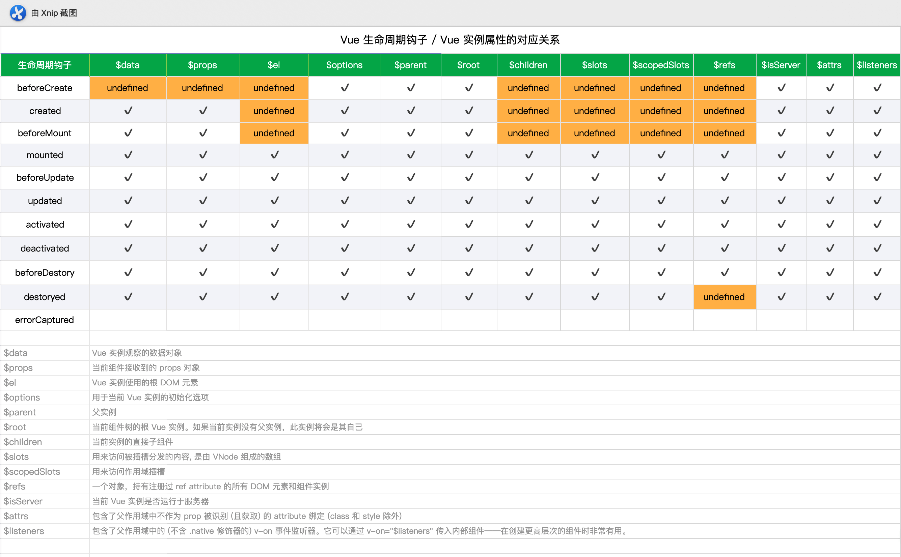

# Vue.js 的生命周期( lifecycle )和其钩子函数( hooks )详解

?> 在一个 vue 实例( vm )的不同生命周期阶段，提供给我们可以 `添加应用逻辑代码` 的入口，这称为 `生命周期钩子`。

## 1. 生命周期和实例属性

### 1-1. 生命周期

Vue 2.0 官方整理的生命周期示意图如下：



### 1-2. 各个阶段能拿到的实例属性

Vue 2.0 各个阶段能拿到的实例属性如下表格所示：



## 2. 各个生命周期阶段一般做哪些操作

### 2-1. beforeCreate

`实例初始化 new Vue()` 之后，`数据观测 ($props、$data、computed) 和 event/watcher 事件配置` 之前，这个阶段能获取到 `this(vm)`。

推荐操作：初始化非响应式变量、添加 loading 事件，提升用户体验。

### 2-2. created

`实例创建完成后` 被立即调用，`数据观测 ($props、$data、computed)，属性和方法的运算，watch/event 事件回调` 已经可以获取到了。

推荐操作：简单的 ajax 请求，页面的初始化，结束 loading 事件。

### 2-3. beforeMount

`在挂载开始之前` 被调用：相关的 render 函数首次被调用。

?> 注意 `beforeMount` 期间，获得的 `$el` 还是虚拟 DOM

推荐操作: 

### 2-4. mounted

`el` 被新创建的 `vm.$el` 替换，并 `挂载到实例上去之后` 调用该钩子。如果 root 实例挂载了一个文档内元素，当 mounted 被调用时 vm.\$el 也在文档内。

?> 注意 `mounted` 不会承诺所有的子组件也都一起被挂载。如果你希望等到整个视图都渲染完毕，可以用`vm.$nextTick` 替换掉 mounted

推荐操作：常用于获取 VNode 信息和操作，ajax 请求。

### 2-5. beforeUpdate

数据更新时调用，发生在虚拟 DOM 打补丁之前。这里适合在更新之前访问现有的 DOM，比如手动移除已添加的事件监听器。

### 2-6. updated

组件 DOM 已经更新，可执行依赖于 DOM 的操作。但子组件不一定已完成重绘，如操作要整个视图都重绘完毕，可以用 `vm.$nextTick` 替换掉 `updated`

?> 不要在此函数中操作数据（修改属性），会陷入死循环。

### 2-7. activated

被 `keep-alive` 缓存的组件激活时调用。

该钩子在服务器端渲染期间不被调用。

推荐操作：被 keep-alive 包围的组件由于激活时，不会经历前 4 个生命周期阶段，会造成数据缓存现象，例如info从路由拿过来的数据进行展示前需要重新赋值。

### 2-8. deactivated

被 `keep-alive` 缓存的组件停用时调用。

该钩子在服务器端渲染期间不被调用。

推荐操作：

### 2-9. beforeDestroy

实例销毁之前调用。在这一步，实例仍然完全可用。

推荐操作：销毁定时器、解绑全局事件、销毁插件对象，删除二次确认。

### 2-10. destroyed

Vue 实例销毁后调用。调用后，Vue 实例指示的所有东西都会解绑定，所有的事件监听器会被移除，所有的子实例也会被销毁。

### 2-11. errorCaptured

当捕获一个来自 `子孙组件` 的错误时被调用。此钩子会收到三个参数：错误对象、发生错误的组件实例以及一个包含错误来源信息的字符串。此钩子可以返回 false 以阻止该错误继续向上传播。

```javascript

errorCaptured(error, vm, info) {
    console.log(`${error.stack}\n found in ${vm}, info is ${info}`);
    // 阻止向上传播
    return false;
}
```

?> errorCaptured 获取到的实例是发生错误的组件实例，能拿到的实例属性，要看报错位置。例如子组件在 beforeCreate 阶段报错，那 errorCaptured 只能拿到在此阶段能拿到的属性，如这个阶段是拿不到 vm.$data，能拿到 vm.$attrs

## 3. 谈单组件生命周期

  1. 初始化组件时，执行了 `beforeCreate` / `created` / `beforeMount` / `mounted`

  2. 当改变 data 中定义的变量（响应式变量）时，会执行 `beforeUpdate` / `updated`

  3. 当切换组件（当前组件未缓存）时，会执行 `beforeDestory` / `destroyed`

  4. 初始化和销毁时的生命钩子函数均只会执行一次，`beforeUpdate` / `updated` 可多次执行

## 4. 谈父子组件生命周期

### 4-1. 创建组件

- 先触发父组件的 `beforeCreate`，`created`，`beforeMount`，再触发子组件的 `beforeCreate`，`created`，`beforeMount`，`mounted`，最后触发父组件的 `mounted`

### 4-2. 更新组件

- 更新父组件时
    - 先触发父组件的 `beforeUpdate`，再触发子组件的 `beforeUpdate`、`updated`，最后触发父组件的 `updated`

- 更新子组件时
    - 只会触发子组件的 `beforeUpdate`、`updated`

### 4-3. 摧毁组件

- 如果父组件通过 v-if 指令摧毁和创建子组件，那么

    - **摧毁子组件**时，先触发父组件的 `beforeUpdate`，再触发子组件的 `beforeDestroy`，`destroyed`，最后触发父组件的 `updated`

    - **创建子组件**时，先触发父组件的 `beforeUpdate`，再触发子组件的 `beforeCreate`，`created`，`beforeMount`，`mounted`，最后触发父组件的 `updated`

- 摧毁父组件

    - 先触发父组件的 `beforeDestroy`，再触发子组件的 `beforeDestroy`，`destroyed`，最后触发父组件的 `destroyed`

    - 如果父组件被 `keep-alive` 组件包围，只触发父组件的 `deactivated`

## 5. 谈兄弟组件生命周期

  1. 组件的初始化（`beforeCreate` / `created` / `beforeMount` ）分开进行，挂载( `mounted` )是从上到下依次进行

  2. 当没有数据关联时，兄弟组件之间的更新和销毁是互不关联的。

## 6. 摧毁组件的方式

### 6-1. 外部摧毁

调用 `vm.$destroy`

> 不建议使用这种方式，会清理它与其它实例的连接，解绑它的全部指令及事件监听器。但没有摧毁组件的 DOM 结构。

### 6-2. 内部摧毁

v-if，v-for 以数据驱动的方式控制子组件的生命周期

> **建议使用这种方式，能彻底摧毁该组件。**