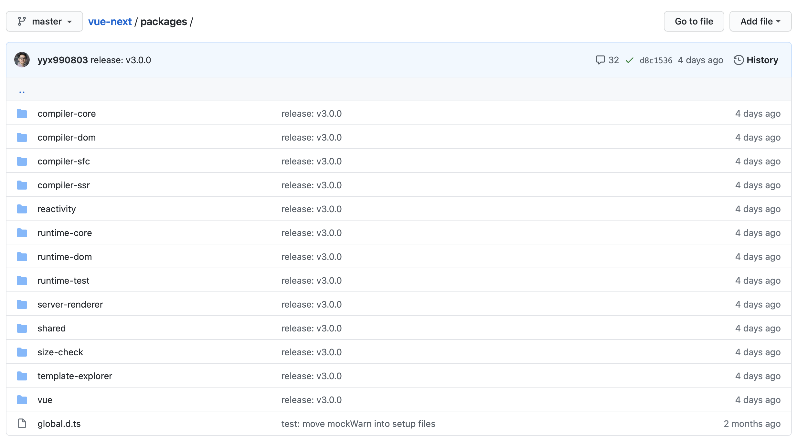
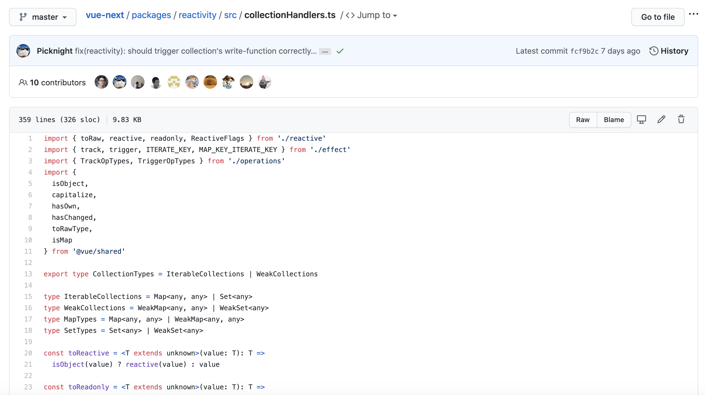

# Vue.js 3.0 做了哪些优化

2020 年 09 月 22 日

## 一、源码优化

### 1、更好的代码管理方式：monorepo



### 2、有类型的 JavaScript：TypeScript



## 二、性能优化

### 1、源码体积优化

1. 移除一些冷门的 feature（比如 filter、inline-template 等）；
2. 引入 tree-shaking 的技术，减少打包体积。

### 2、数据劫持优化

1. `Object.defineProperty` API 本身有局限

  - 需要预先知道 key 值，所以不能检测到对象属性的增加和删除
  
2. 嵌套层级较深的对象，需要遍历递归将其变为响应式数据，性能负担大

针对上面的两个点，Vue 3.0 是这样解决的

引入 `Proxy` API 劫持整个对象，对象属性和删除都能检测到，共有 13 种操作对象的方式都能检测到。

对于嵌套层级较深的对象，Vue 3.0 不再是无脑递归将它转换为 setter 和 getter，而是在 getter 中将接触到的对象进行响应式转换。

### 3、编译优化

1. Vue 2.x 数据更新触发重新渲染的粒度是组件级的，数据更新一次后，需要遍历整个组件的 vnode 树，性能与该组件的模板大小负相关，即模板越大，性能越差

针对上面的点，Vue 3.0 是这样优化的

引入 `Block Tree`，在编译组件阶段（template => render function），基于动态节点指令切割的嵌套区块，将更新性能变为与动态节点的个数的负相关，即动态节点的个数越多，性能越差

## 三、语法 API 优化：Composition API

### 1、优化逻辑组织

1. 大型组件中，包含多个逻辑关注点，每一个关注点都有自己的 Options，如果需要修改一个逻辑点关注点，就需要在单个文件中不断上下切换和寻找。

针对上面的点，Vue 3.0 是这样优化的

引入 `Composition` API，将某个逻辑关注点相关的代码全都放在一个函数里，这样当需要修改一个功能时，就不再需要在文件中跳来跳去。

### 2、优化逻辑复用

1. mixins API 带来的问题

  - 命名冲突
  - 数据来源不清晰

引入 `Composition` API，将其定义为 hook 函数，在使用到该 mixin 的组件中调用

```javascript
import { ref, onMounted, onUnmounted } from 'vue'
export default function useMousePosition() {
  const x = ref(0)
  const y = ref(0)
  const update = e => {
    x.value = e.pageX
    y.value = e.pageY
  }
  onMounted(() => {
    window.addEventListener('mousemove', update)
  })
  onUnmounted(() => {
    window.removeEventListener('mousemove', update)
  })
  return { x, y }
}
```

```vue
<template>
  <div>
    Mouse position: x {{ x }} / y {{ y }}
  </div>
</template>
<script>
  import useMousePosition from './mouse'
  export default {
    setup() {
      const { x, y } = useMousePosition()
      return { x, y }
    }
  }
</script>
```

### 3、引入 RFC：使每个版本改动可控

Request For Comments，旨在为新功能进入框架提供一个一致且受控的路径。

通过阅读 RFC，你可以了解每一个 feature 采用或被废弃掉的前因后果。


