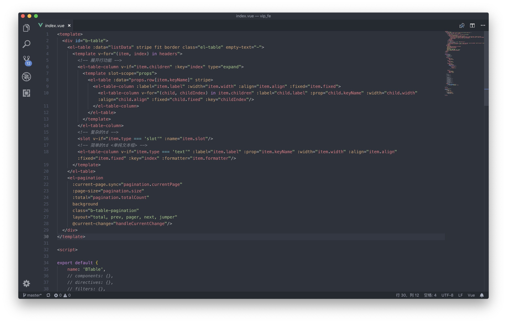

# Vue.js定制组件

2018年11月18日

### 1. 定制 `element-table`

🏹 目标

1. 抽离 `headers` 配置
2. 根据业务定制 `td`
3. 分页 `e-pagination`

💡 方案




```javascript
props: {
    listData: {
        type: Array,
        required: true,
    },
    headers: {
        type: Array,
        required: true,
    },
    expand: {
        type: Boolean,
        required: false,
        default: false,
    },
    pagination: {
        type: Object,
        required: false,
        default: function () {
            return {
                currentPage: 0, // 当前页码
                size: 0,        // 每页大小
                totalCount: 0,  // 总数
            };
        },
    }
}
```

```javascript
// headers配置示例
const header1 = [
    {
        label: 'td 名称',
        width: 'td 宽度',
        keyName: 'td 对应数据字段',
        align: 'td 是否居中',
        fixed: false, // td 是否固定列
        type: 'slot', // td 类型, 可选择值 ‘text’，‘slot’
        slot: 'action', 
    },
    {   ...
        type: 'text',
        
    },
    {   ...
        children: [
            { ... },
            { ... },
        ],
    },
];
export default header1;
```

参考出处如下：

https://jsfiddle.net/g5jykkrn/2/