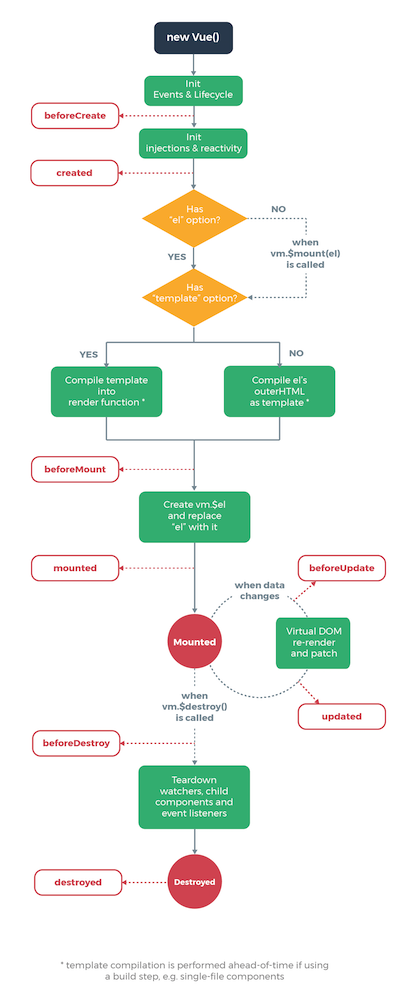
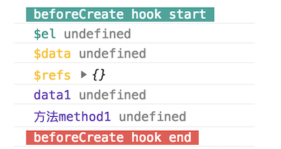
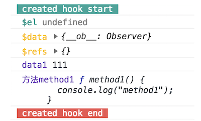
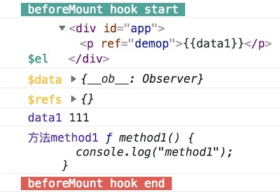
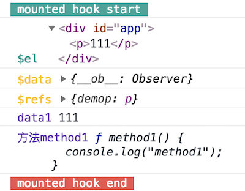

# Vue.js的生命周期(lifecycle)和其钩子函数(hooks)详解

2018年09月07日

?> 在一个vue实例(vm)的不同生命周期阶段，提供给我们可以`添加应用逻辑代码`的入口，这称为`生命周期钩子`。

## 生命周期和钩子函数

**Vue 2.0** 官方整理的生命周期示意图如下



### 0. 实例说明

新建一个vue对象，并且初始化

```html
<div id="app">
  <p ref="demop">{{data1}}</p>
  <input type="text" v-model="data1">
</div>
```

```javascript
const vm = new Vue({
  el: "#app",
  name: 'vue-lifecycle-demo',
  data: {
    data1: "111"
  },
  methods: {
    method1() {
      console.log("method1");
    }
  }
})
```
这里补充`vue实例vm` 有如下属性：

`$data`，`$props`，`$el`，`$options`，`$parent`，`$root`，

`$children`，`$slots`，`$scopedSlots`，`$refs`，`$isServer`，`$attrs`，`$listeners`

### 1. beforeCreate

  `实例初始化new Vue()`之后，`数据观测 ($props、$data、computed) 和 event/watcher 事件配置`之前，这个阶段能获取到 `this(vm)`。
  
  可获取的属性：`$options`

  获取不到的属性(undefined)：`$props`, `$data`, `$el`, `$refs`等

  

  _**推荐** 🔑 : 初始化非响应式变量_

### 2. created

  `实例创建完成后`被立即调用，`数据观测 ($props、$data、computed)，属性和方法的运算，watch/event 事件回调` 已经可以获取到了。
  
  可获取的属性：`$options`, `$props`,  `$data`

  获取不到的属性和数据： `$el`, `$refs`

  

  _**推荐** 🔑 : 简单的ajax请求，页面的初始化。_

### 3. beforeMount

  `在挂载开始之前`被调用：相关的 render 函数首次被调用

  可获取的属性： `$options`, `$data`, `$props`,  `$el`

  获取不到的属性和数据： `$refs`

?> 注意 `beforeMount`期间，获得的`$el`还是虚拟dom，`{{}}`

  

### 4. mounted

  `el` 被新创建的 `vm.$el` 替换，并`挂载到实例上去之后`调用该钩子。如果 root 实例挂载了一个文档内元素，当 mounted 被调用时 vm.$el 也在文档内。

?> 注意 `mounted` 不会承诺所有的子组件也都一起被挂载。如果你希望等到整个视图都渲染完毕，可以用`vm.$nextTick` 替换掉 mounted：

  可获取的属性：`$options`, `$data`, `$el`, `$props`, `$refs`

  

  _**推荐** 🔑 : 常用于获取VNode信息和操作，ajax请求。_

### 5. beforeUpdate

  数据更新时调用，发生在虚拟 DOM 打补丁之前。这里适合在更新之前访问现有的 DOM，比如 *手动移除已添加的事件监听器*。

### 6. updated

  组件 DOM 已经更新，可执行依赖于 DOM 的操作。但子组件不一定已完成重绘，如操作要整个视图都重绘完毕，可以用 `vm.$nextTick` 替换掉 `updated`

### 7. beforeDestroy

  实例销毁之前调用。在这一步，实例仍然完全可用。 

  _**推荐** 🔑 : 销毁定时器、解绑全局事件、销毁插件对象等操作。_

### 8. destroyed

  Vue 实例销毁后调用。调用后，Vue 实例指示的所有东西都会解绑定，所有的事件监听器会被移除，所有的子实例也会被销毁。

## 单组件生命周期

1. 初始化组件时，执行了`beforeCreate` / `created` / `beforeMount` / `mounted`
2. 当改变data中定义的变量（响应式变量）时，会执行`beforeUpdate` / `updated`
3. 当切换组件（当前组件未缓存）时，会执行`beforeDestory` / `destroyed`
4. 初始化和销毁时的生命钩子函数均只会执行一次，`beforeUpdate` / `updated`可多次执行

## 父子组件生命周期

1. 仅当子组件完成挂载(`beforeCreate` / `created` / `beforeMount` / `mounted`)后，父组件才会挂载(`beforeCreate` / `created` / `beforeMount` => **暂停等待** 子组件`mounted`完成)
2. 当子组件完成挂载后，父组件会主动执行一次 `beforeUpdate` / `updated`钩子函数（仅首次）
3. 父子组件在data变化中是分别监控的，但是在props变化中父组件先`beforeUpdate` **暂停等待** 子组件 `beforeUpdate` / `updated` 完成再调用`updated`
4. 销毁父组件时，先将子组件销毁后才会销毁父组件

## 兄弟组件生命周期

1. 组件的初始化（`beforeCreate` / `created` / `beforeMount` ）分开进行，挂载(`mounted`)是从上到下依次进行
2. 当没有数据关联时，兄弟组件之间的更新和销毁是互不关联的

参考出处如下：

https://juejin.im/post/5afd7eb16fb9a07ac5605bb3

https://juejin.im/entry/5aee8fbb518825671952308c