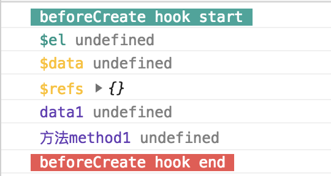
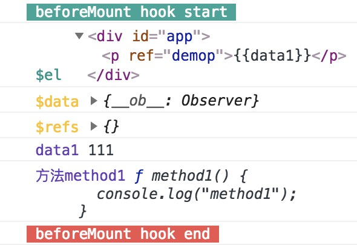
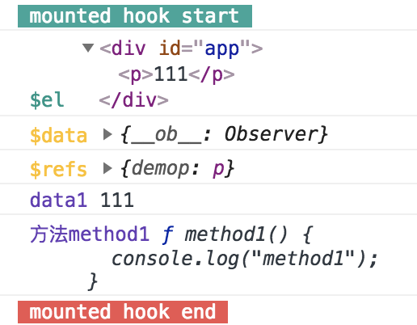

# Vue.js的生命周期(lifecycle)和其钩子函数(hooks)详解

2018年09月07日

?> 在一个vue实例(vm)的不同生命周期阶段，提供给我们可以`添加应用逻辑代码`的入口，这称为`生命周期钩子`。

## 生命周期

**Vue 2.0**官方整理的生命周期示意图如下


### 0. 实例说明

新建一个vue对象，并且初始化

```html
<div id="app">
  <p ref="demop">{{data1}}</p>
  <input type="text" v-model="data1">
</div>
```

```javascript
const vm = new Vue({
  el: "#app",
  name: 'vue-lifecycle-demo',
  data: {
    data1: "111"
  },
  methods: {
    method1() {
      console.log("method1");
    }
  }
})
```

### 1. beforeCreate

  `实例初始化`之后，`数据观测 (data observer) 和 event/watcher 事件配置之前`，这个阶段只能获取到 `this(vue实例)`。
  
  可获取的属性：`this`, `this.$options`

  获取不到的属性和数据(undefined)：`this.$data`, `this.$el`, `this.data1`, `this.method1`, `this.$refs`

  

### 2. created

  `实例创建完成后`被立即调用，`数据观测 (data observer)，属性和方法的运算，watch/event 事件回调` 已经可以获取到了。
  
  可获取的属性：`this`, `this.$data`, `this.data1`, `this.method1`

  获取不到的属性和数据： `this.$el`, `this.$refs`

  

### 3. beforeMount

  `在挂载开始之前`被调用：相关的 render 函数首次被调用, 该钩子在服务器端渲染期间不被调用。

  可获取的属性：`this`, `this.$el`, `this.$data`, `this.data1`, `this.method1`

  获取不到的属性和数据： `this.$refs`

?> 注意 `beforeMount`期间，获得的`this.$el`还是虚拟dom，`{{}}`

  

### 4. mounted

  `el` 被新创建的 `vm.$el` 替换，并`挂载到实例上去之后`调用该钩子。如果 root 实例挂载了一个文档内元素，当 mounted 被调用时 vm.$el 也在文档内。

?> 注意 `mounted` 不会承诺所有的子组件也都一起被挂载。如果你希望等到整个视图都渲染完毕，可以用`vm.$nextTick` 替换掉 mounted：

  可获取的属性：`this`, `this.$el`, `this.$data`, `this.data1`, `this.method1`, `this.$refs`

  获取不到的属性和数据： ``

  

## 生命周期钩子